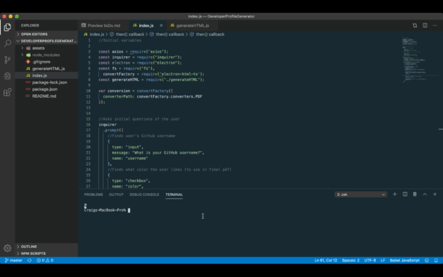

# DeveloperProfileGenerator

This application is designed to prompt a user to input their Github user name and to choose a color. Once this is done, the application dynamically creates a color-themed pdf containing information from their Github profile.

## Interface
The user simply needs to answer the questions when prompted, and the application will then take over, dynamically creating both an html and pdf file.

## Technologies
This site was written using:
* Node.js
* Inquirer
* Axios
* Electron-html-to
* Javascript
* HTML
* CSS

## Credits
In setting up this project, I closely followed the guidelines provided by the [UCF Coding Bootcamp](https://github.com/UCF-Coding-Boot-Camp/UCF-ORL-FSF-FT-11-2019-U-C).

You can see the finished pdf [here](https://drive.google.com/drive/folders/1m_1_HUjB8Quek_mzf5qKjbmHiuvCpyBD?usp=sharing).